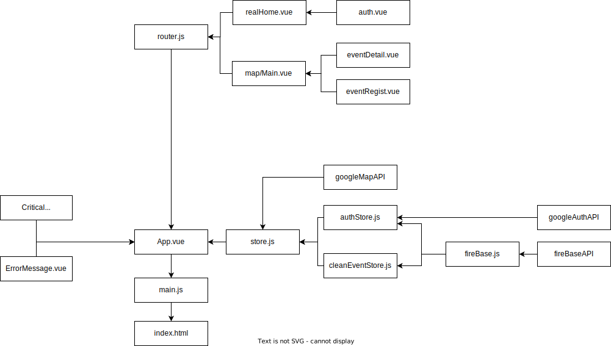

##  &nbsp; SEASHEPHERD_OCEAN_CLEAN

해양환경 NGO '시셰퍼드 코리아'의 환경정화활동 지원을 위해 

제작된 웹 페이지 입니다.

[Main Branch로 이동하기](https://github.com/vonovo123/SeaShepherd_OceanClean)
 
[DEMO 페이지로 이동하기](https://vonovo123.github.io/SeaShepherd_OceanClean/)

### 화면 구성도
 

## 컴포넌트별 상세 구성
- [랜딩](./devNote/랜딩페이지.md)
- [인증](./devNote/인증.md)
- [지도](./devNote/지도.md)
- [등록](./devNote/등록.md)
- [상세](./devNote/상세.md)
- [에러](./devNote/에러.md)