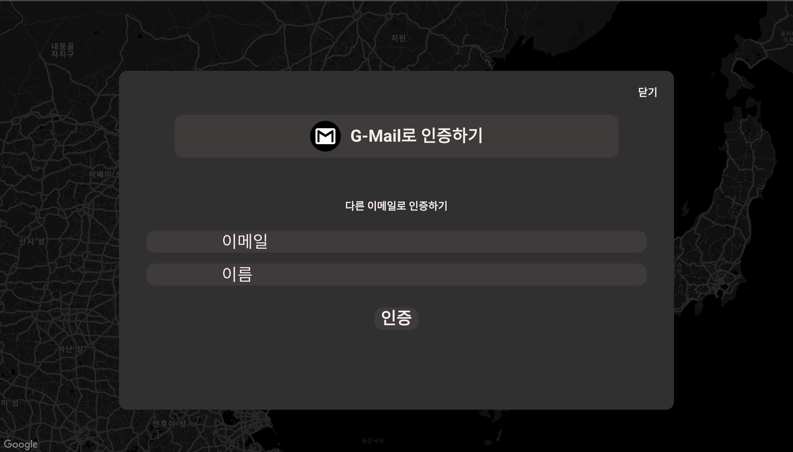
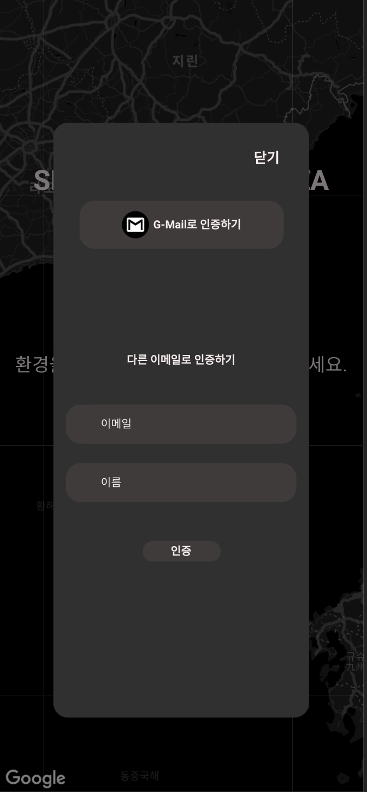

## 인증 

<div style="width:300px;">
    <div>브라우져</div>
    <br/>
    
</div>
</br>
<div style="width:200px;">
    <div>모바일</div>
    <br/>
    
</div>
<br>

### Google Auth API를 활용한 사용자 인증
 - 구글 인증을 이용해 이벤트 등록에 필요한 이름,이메일 정보를 받아옵니다.
 - 인증 토큰을 보유해야 지도 화면으로 이동할 수 있습니다.

```javascript
      //기 인증상태이면 바로 지도화면으로 통과
     if (this.authInfo.isAuth) {
        this.$emit('setShowAuthFlag', false);
        this.$store.dispatch('moveToMaps');
      } else {
        try {
          //gmail 인증
          await this.googleSignIn();
          //인증화면 닫기
          this.$emit('setShowAuthFlag', false);
          //지도로 이동
          this.$store.dispatch('moveToMaps');
        } catch (e) {
          //구글인증 에러상황 처리
          if (e.error) {
            //인증화면 닫은경우
            if (e.error === 'popup_closed_by_user') {
              this.setError({
                message: '사용자에 의해 gmail 인증이 취소됐습니다.',
                type: 'browser',
              });
            } else {
              this.setError({
                message: e.error,
                type: 'browser',
              });
            }
          } else {
            this.setError({
              message:
                '사용자인증 중 알 수 없는 문제가 발생했습니다. 잠시후 다시 시도바랍니다.',
              type: 'critical',
            });
          }
        }
      }
```

### firebase Auth API를 활용한 이메일 인증
- 인증토큰 발급을 위한 인증 이메일을 전송합니다.
``` javascript
      if (this.dirEmail === '') {
        this.dirStatus = '이메일을 입력해주세요';
        return;
      }

      if (this.dirName === '') {
        this.dirStatus = '이름을 입력해주세요';
        return;
      }
      //이메일 정규식 통과하면
      if (emailRegExp.test(this.dirEmail)) {
        //입력한 이메일로 인증메일 전송
        sendEmailAuth(this.dirEmail, this.dirName);
        this.dirStatus = '입력하신 이메일로 인증메일을 전송했습니다';
        //중복입력 방지
        document.querySelector('.direct-btn').style.display = 'none';
        setTimeout(() => {
          document.querySelector('.direct-btn').style.display = 'block';
          this.dirStatus = '';
        }, 3000);
      } else {
        this.dirStatus = '이메일 형식을 다시 확인해주세요';
      }
```