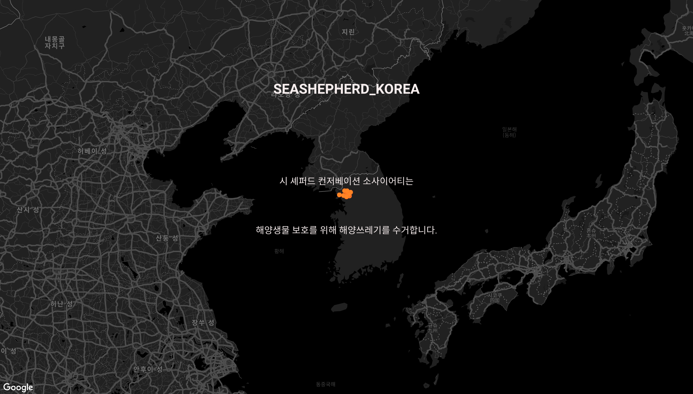
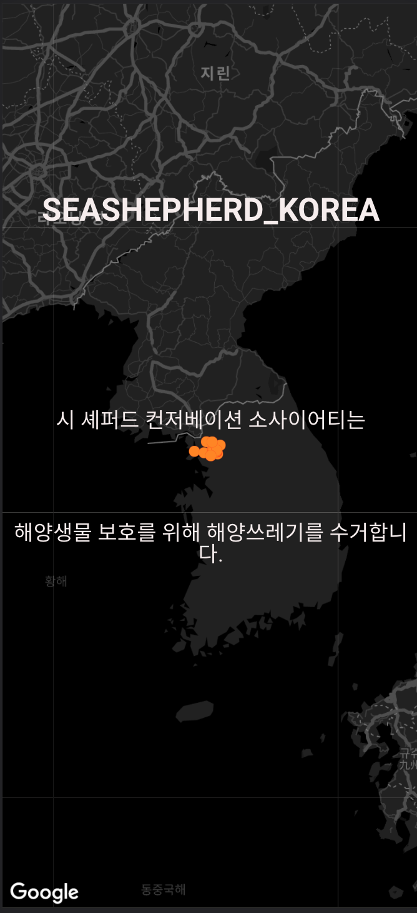

## 렌딩 페이지

<div style="width:300px;">
    <div>브라우져</div>
    <br/>
    
</div>
</br>
<div style="width:200px;">
    <div>모바일</div>
    <br/>
    
</div>
<br>

### 뷰포트(Viewport) 렌더링 방식 설정
 - 모바일 환경을 위해 웹페이지가 화면(Viewport)에 맞게 변경되도록 설정합니다.
<br>

```html 
<meta name="viewport" content="width=device-width, initial-scale=1.0" />
```

### GoogleMap api /deck.gl 라이브러리를 활용한 Data Visual Map 구현
- 구글지도 api에 데이터 시각화 자료를 보여주는 레이어를 추가합니다.
<br>

```javascript
  //ScatterplotLayer 레이어 옵션
  const layerOptions = {
    id: 'scatterplot',
    data: this.eventMarkerData,
    getPosition: d => [
      parseFloat(d.position.lng),
      parseFloat(d.position.lat),
    ],
    getRadius: d => parseInt(d.scale),
    stroked: true,
    getFillColor: [255, 133, 27],
    getLineColor: [255, 38, 27],
    radiusMinPixels: 5,
    radiusMaxPixels: 50,
  };
  //ScatterplotLayer 생성
  const scatterplotLayer = new ScatterplotLayer(layerOptions);
  //googleMap Layer로 지정
  const googleMapsOverlay = new GoogleMapsOverlay({
    layers: [scatterplotLayer],
  });
  googleMapsOverlay.setMap(this.map);
```
``` javascript
      //지도 설정
      const mapOptions = {
        center: this.currentPosition,
        zoom: 6,
        styles: mapStyle,
      };
      //지도 바인딩할 돔객체
      const mapDiv = document.querySelector('.home-content');
      //지도 생성
      try {
        this.map = new google.maps.Map(mapDiv, mapOptions);
        //시각화 지도 생성
        this.setGoogleMapsOverlay();
      } catch (e) {
        throw new Error('시각화지도 생성에 실패했습니다. 다시 시도바랍니다.');
      }
```

<br>

### GSAP 라이브러리를 활용한 텍스트 에니메이션
- GSAP 라이브러리를 활용해 5초 주기로 텍스트가 변경되는 에니메이션을 추가합니다.

```javascript
const $cover = document.querySelector('.home-cover');
  setTimeout(() => {
    gsap.to($cover, {
      duration: 1,
      backgroundColor: 'rgba(0, 0, 0, 0)',
    });
  }, 2000);
  // 텍스트 animation
  const $homeCoverContent = document.querySelector('.home-cover-content');
  $homeCoverContent.style.transfrom = 'translateY(-60px)';
  $homeCoverContent.style.opacity = 0;
  gsap.to($homeCoverContent, {
    duration: 1,
    y: 0,
    opacity: 1,
  });
  //5초후 텍스트 변경
  this.interval = setInterval(() => {
    if (this.viewIdx < 2) {
      this.viewIdx++;
      const $homeCoverContent = document.querySelector(
        `#content${this.viewIdx}`
      );
      $homeCoverContent.style.transfrom = 'translateY(-60px)';
      $homeCoverContent.style.opacity = 0;
      gsap.to($homeCoverContent, {
        duration: 5,
        y: 0,
        opacity: 1,
      });
    } else {
      clearInterval(this.interval);
    }
  }, 4000);
```

<br>

### Google Auth API / firebase Auth API를 활용한 인증
- 인증 이메일을 통해 접근하면 지도 화면으로 리다이렉트 합니다.
- 인증 이메일을 통해 접근한게 아니면 인증 api를 로드 합니다.
```javascript
  //직접입력한 이메일링크를 통해 들어온 상태인지 확인
  const isDirAuth = await this.checkDirAuthLink();
  //링크를 통했으면
  if (isDirAuth) {
    const email = window.localStorage.getItem('emailForSignIn');
    const name = window.localStorage.getItem('nameForSignIn');
    await this.setAuthInfo({
      fullName: name,
      mail: email,
      isAuth: true,
      type: 'dir',
    });
    window.localStorage.removeItem('emailForSignIn');
    window.localStorage.removeItem('nameForSignIn');
    //사용자 정보 획득후 이벤트등록 화면으로 이동
    this.$store.dispatch('moveToMaps');
    return;
    //그냥 들어온상태면
  } else {
    //구글 인증 api load
    await this.loadGoogleAuthClient();
    //직접 인증 api load
    await this.loadDirAuthClient();
  }
```