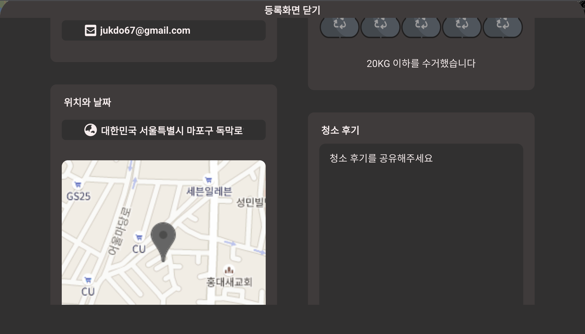
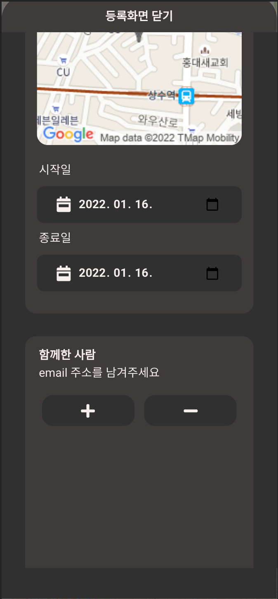

## 상세조회
<div style="width:300px;">
    <div>BROWSER</div>
    <br/>
    
</div>
</br>
<div style="width:200px;">
    <div>MOBILE</div>
    <br/>
    
</div>
<br>

### 라이프사이클 훅을 이용한 인증정보 받아오기
- 등록 컴포넌트 생성 후 이루어지는 인증정보 로드를 제어하기 위해 vue 라이프사이클 훅 중 하나인 updated를 활용합니다.
```javascript
  updated() {
    this.event.userInfo.name = this.authInfo.fullName;
    this.event.userInfo.email = this.authInfo.mail;
  },
```

### javascrpt IntersectionObserver를 활용한 등록버튼 에니메이션
- IntersectionObserver 객체를 활용해 컴포넌트 하단 진입시 등록버튼이 보여지는 에니메이션 등록
```javascript
  //observe test
    const $observe = document.querySelector('#observe');
    const $regBtn = document.querySelector('#registBtn');
    //등록버튼 옵져빙
    const cb = entries => {
      if (entries[0].isIntersecting) {
        gsap.to($regBtn, {
          duration: 1,
          y: 0,
          opacity: 1,
        });
      } else {
        gsap.to($regBtn, {
          duration: 1,
          y: 100,
          opacity: 0,
        });
      }
    };
    let observer = new IntersectionObserver(cb);
    observer.observe($observe);
```

### 사용자 이미지 업로드와 미리보기
- javascript 로직을 통해 사용자이미지 업로드와 미리보기 기능을 구현합니다.
```javascript
 const $photo = document.querySelector('#photo');
      const files = [...e.target.files];
      if (files.length + this.event.photos.length > 10) {
        e.target.value = '';
        this.setError({
          message: '사진은 최대 10장까지 업로드 가능합니다.',
          type: 'browser',
        });
        return;
      }
      files.forEach(file => {
        //db에 업로드할 file array
        this.event.photos.push(file);
        const $img = document.createElement('img');
        $img.classList.add('photo-prev');
        //등록화면에 보여주기용 src
        $img.src = `${URL.createObjectURL(file)}`;
        $img.setAttribute('data-id', this.event.photos.length - 1);
        $photo.insertBefore($img, $photo.firstChild);
        $img.addEventListener('click', el => {
          const start = Number(el.target.dataset.id);
          el.target.remove();
          for (let i = start + 1; i < this.event.photos.length; i++) {
            this.event.photos[i - 1] = this.event.photos[i];
          }
          this.event.photos.pop();
        });
      });
      e.target.value = '';
```

### firebast storage 를 활용한 이미지 업로드
- url 생성을위해 사용자등록 이미지를 스토리지에 업로드 합니다
```javascript
      //이미지 url 생성을 취한 스토리지에 파일 선업로드
      const promises = [];
      files.forEach(file => {
        if (file) {
          promises.push(
            upLoadFile(eventObj.date.from, eventObj.userInfo.email, file)
          );
        }
      });
      // //병렬처리
      const photoUrlArray = await Promise.all(promises);
      //storage url get
      photoUrl = [...photoUrlArray];
      if (photoUrl.includes('error')) {
        throw new TypeError(
          '파일업로드에 실패했습니다. <br/> 잠시후 다시 시도바랍니다.',
          'critical',
          'storageUpload'
        );
      }
```
```javascript
//스토리지 파일 등록
  export const upLoadFile = async function (date, email, file) {
    // eslint-disable-next-line no-async-promise-executor
    try {
      const imageRef = ref(storage, `images/${date}/${email}/${file.name}`);
      const snapshot = await uploadBytesResumable(imageRef, file, metadata);
      const url = await getDownloadURL(snapshot.ref);
      return url;
    } catch (error) {
      return 'error';
    }
  };
```
- 이미지 등록 실패 시 롤백합니다
```javascript
      const promises = [];
      files.forEach((file, idx) => {
        if (photoUrl[idx] !== 'error') {
          if (file) {
            promises.push(
              desertFile(eventObj.date.from, eventObj.userInfo.email, file.name)
            );
          }
        }
      });
      await Promise.all(promises);
```


### firebase database를 활용한 이벤트 등록
- firebase database가 제공하는 트렌젝션 기능을 활용해 마커와 이벤트 상세를 database에 함께 등록합니다.

```javascript
  const photoUrlArray = await Promise.all(promises);
      //storage url get
      photoUrl = [...photoUrlArray];
      if (photoUrl.includes('error')) {
        throw new TypeError(
          '파일업로드에 실패했습니다. <br/> 잠시후 다시 시도바랍니다.',
          'critical',
          'storageUpload'
        );
      }
      await api.transactionFetchData(
        {
          method: 'post',
          table: 'events',
          id: eventObj.id,
          obj: { ...eventObj, photoUrl },
        },
        {
          method: 'post',
          table: 'markers',
          id: eventObj.id,
          obj: {
            id: eventObj.id,
            position: eventObj.position,
            scale: eventObj.scale,
          },
        }
      );
      return { photoUrl };
```
