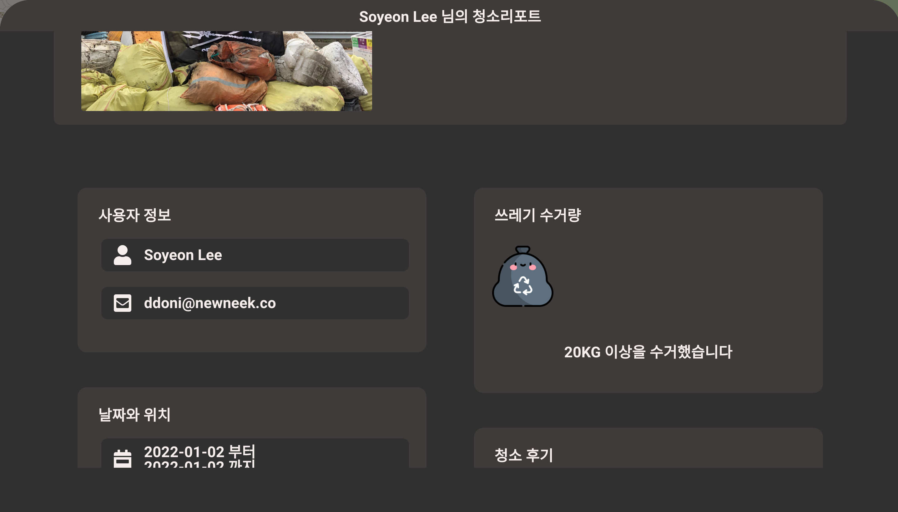
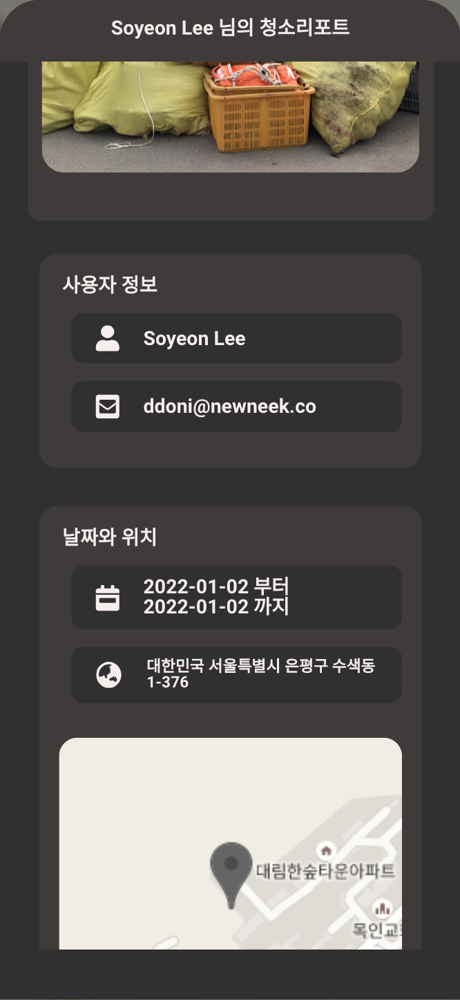

## 상세조회
<div style="width:300px;">
    <div>BROWSER</div>
    <br/>
    
</div>
</br>
<div style="width:200px;">
    <div>MOBILE</div>
    <br/>
    
</div>
<br>

### Vuex Store에 저장된 이벤트 상세정보 시각화
- 지도화면에서 이벤트마커를 선택해 조회한 환경정화활동 상세 정보를 시각화 합니다.
```javascript
  computed: {
    ...mapGetters({
      //이벤트 상세정보
      eventDetail: 'cleanEventStore/EventDetail',
      //위치 snapShot 정보
      mapSnapshot: 'cleanEventStore/MapSnapShot',
    }),
  },
```