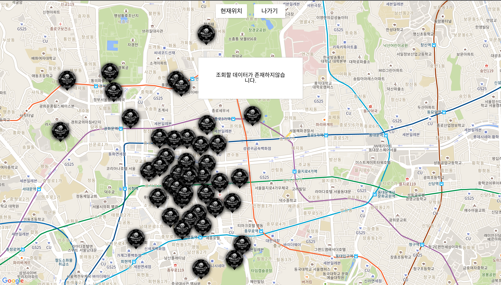

## 에러
<div style="width:300px;">
    <div>BROWSER</div>
    <br/>
    
</div>
</br>
<div style="width:300px;">
    <div>MOBILE</div>
    <br/>
    
</div>
<br>

### 에러 종류에 따른 에러화면 분기
- 치명적인 사용자 오류 야기할 수 있는 오류는 Critical error 로 분류해 처리합니다.
```html
  <div class="container">
    <div class="main">
      <router-view></router-view>
    </div>
    <ErrorMessage
      v-show="error.type !== 'critical' && error.flag"
      :errorMessage="error.message"
    ></ErrorMessage>
    <CriticalErrorMessage
      v-show="error.type === 'critical' && error.flag"
      :criticalErrorMessage="error.message"
    >
    </CriticalErrorMessage>
  </div>
```
```javascript
    SET_ERROR(state, error) {
      state.error = {
        flag: true,
        type: error.type,
        message: error.message,
      };
      //critlcal error가 아닌경우 3초 후 화면에서 제거
      if (error.type !== 'critical') {
        setTimeout(() => {
          state.error = {
            flag: false,
            type: '',
            message: '',
          };
        }, 3000);
      }
    },
```