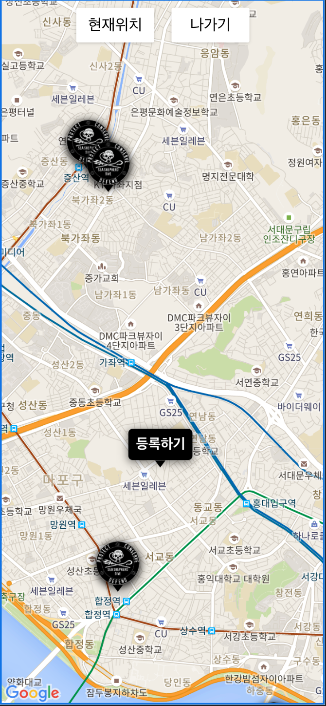

## 지도
<div style="width:300px;">
    <div>BROWSER</div>
    <br/>
    
</div>
</br>
<div style="width:200px;">
    <div>MOBILE</div>
    <br/>
    
</div>
<br>

### googleMap Api를 활용한 지도 불러오기

- 등록된 환경정화활동 마커를 지도상에 표현하기위해 Google 지도를 불러옵니다.
- 환경정화활동 등록마커를 지도상에 표현하기위해 Google 지도를 불러옵니다.

```javascript
      try {
        this.map = new google.maps.Map(document.querySelector('.body'), {
          center: this.currentPosition,
          zoom: 16,
        });
        //mounted에서 최종예외처리
      } catch (e) {
        throw new Error(
          '구글 지도 불러오기에 실패했습니다.</br>잠시후 다시 시도 바랍니다.'
        );
      }
```


### browser navigator.geolocation 값을 활용한 현재위치 마커 생성 / geoCoder를 활용한 문자열 주소 생성 

 - 브라우저에서 제공하는 현재위치값을 활용해 구글지도 상에 현재위치 마커를 생성합니다.
 - 현재위치마커는 환경정화활동 이벤트 등록에 활동합니다.
 ```javascript
  try {
        const content = document.createElement('div');
        content.innerHTML = '등록하기';
        content.classList.add('custom-marker-text');
        const geocoder = new google.maps.Geocoder();
        //geoCoder를 활용한 문자열 주소 생성
        const address = await geocoder.geocode({
          location: this.currentPosition,
        });
        //문자열 주소 store에 저장
        this.setCurAddress(address.results[0].formatted_address);
        //기존 현재위치마커 삭제
        if (this.curMarker) {
          this.curMarker.setMap(null);
        }
        //현재위치 마커 등록
        this.curMarker = new CurLocMaker(
          new google.maps.LatLng(
            this.currentPosition.lat,
            this.currentPosition.lng
          ),
          content
        );
        this.curMarker.setMap(this.map);
        this.curMarker.addClickEvent(this.fncClickCurMarker);
    } catch (e) {
      throw new Error(
        '현재위치 조회에 실패했습니다.<br/>브라우저의 위치정보 제공상태를 확인하세요.'
      );
    }
 ```
 - 지도클릭시 현재위치를 임의로 변경할 수 있습니다.
 <br>

 ```javascript
       try {
        //클릭 지점 위치 저장
        await this.setCurPosition();
        // 현재위치 변경
        await this.setCurMarker();
        this.map.setCenter(this.currentPosition);
        this.map.setZoom(16);
      } catch (e) {
        let message = e.message;
        this.setError({
          message,
          type: 'critical',
        });
      }
 ```

 ### firebase Database를 활용한 기등록된 환경정화활동 조회 / 조회 마커 생성
 
 - Database에 저장된 환경정화활동을 조회하여 마커 형태로 구글지도에 등록합니다.
 ```javascript
       this.eventMarkers = this.eventMarkerData.map(e => {
        const content = document.createElement('img');
        content.classList.add('custom-marker-img');
        content.src = require('@/assets/images/pngwing.png');
        const marker = new CurLocMaker(
          new google.maps.LatLng(e.position.lat, e.position.lng),
          content
        );
        marker.setMap(this.map);
        marker.addClickEvent(() => {
          this.clickEventMarker(e);
        });
      });
 ```
 - 조회마커 클릭시 환경정화활동 상세정보를 조회합니다.
 ```javascript
        //이벤트 상세정보 조회
        await this.setEventDetail(event);
        result = event;
        //위치정보 snapshot 생성
        this.snapShot(result.position);
        this.showBlock = true;
        //상세정보 컴포넌트 show
        const $target = document.querySelector('.event-detail');
        gsap.to($target, {
          duration: 0.5,
          top: '0',
        });
 ```